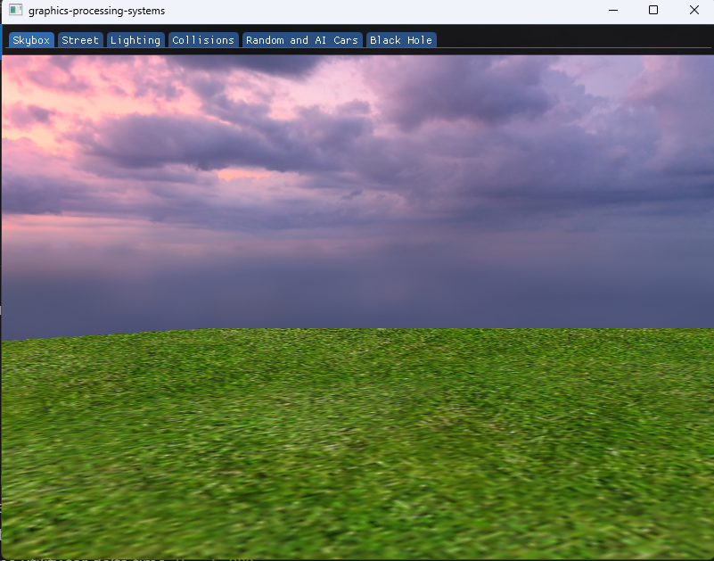
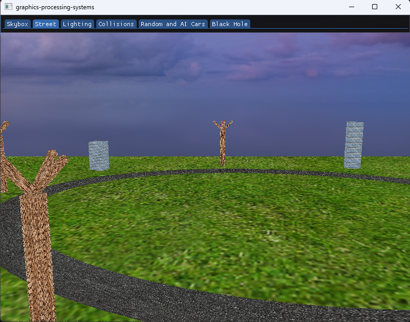
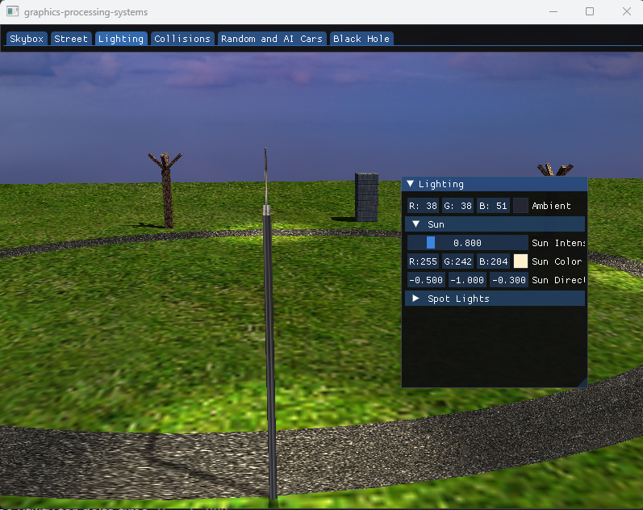
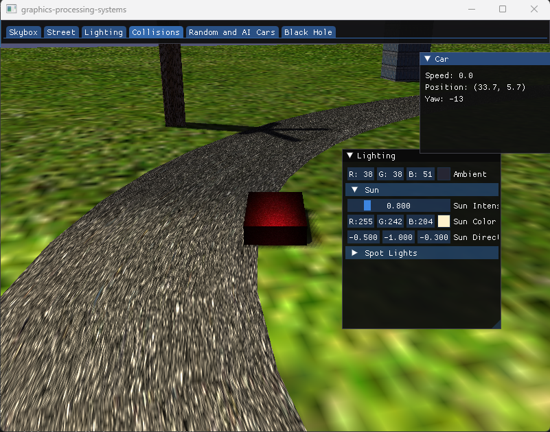
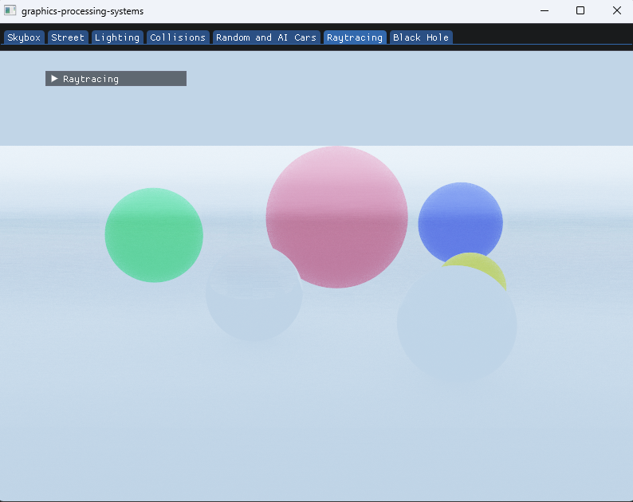
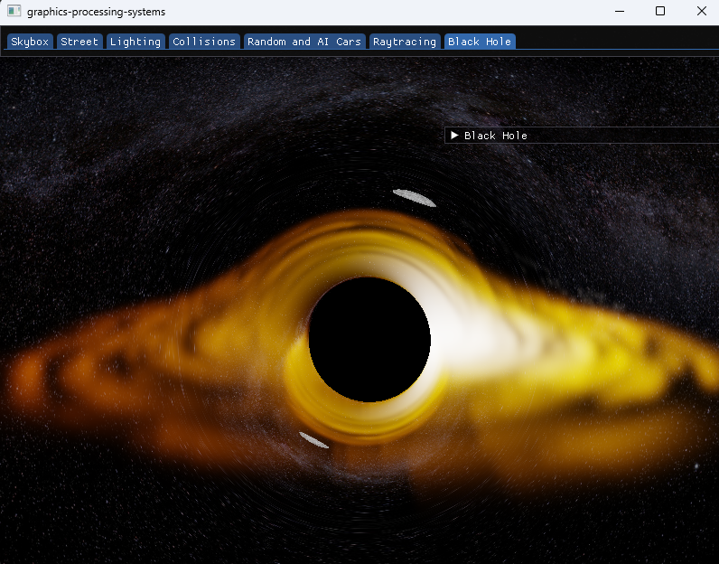

# 👾 opengl-imgui-cmake-template

A quick and easy way to get started using OpenGL 3.3 Core Profile together with [imgui](https://github.com/ocornut/imgui) in a CMake environment.

This template only contains a wrapper class for shaders, and one for the window with appropriate `Initialize/LoadContent/Update/Render` as a game loop.

The shader class allows for **hot-reloading** of the fragment shader, so whenever you modify the `testing.fs` file in the `build/resources/shaders/` directory, the shader will automagically be reloaded!

**NOTE:** The shader files in `resources/shaders/` are copied into the `build/` directory upon build, so if you want to save your hot-reloaded changes, then you must also modify the shaders in `resources/shaders/` directory.

## Screenshots

### Skybox


### Street


### Lighting


### Collisions


### Random and AI Cars


## Experimental

These were built in a separate experimental repo and are not part of the main scene system.

### Raytracing


Still working through some issues with this one — not fully functional yet.

### Blackhole


Fully functional. The gravitational lensing effect is my favourite part of this one.

## Getting started

1. Create a new repo by clicking `Use this template` up to the right!
2. Download some [GLFW pre-compiled binaries](https://www.glfw.org/download) and put the `libglfw3.a` file in `libs/glfw/`.
3. Compile with CMake and then run it! Piece of cake!

## Building

Requires CMake 3.10+ and a C++20 compiler. Tested with MSYS2 MinGW64.

```bash
mkdir build && cd build
cmake .. -G "Ninja"
cmake --build .
```

Or with Make:

```bash
mkdir build && cd build
cmake .. -G "MinGW Makefiles"
mingw32-make
```

## Running

From the build directory:

```bash
./opengl-imgui-cmake-template.exe
```

The executable expects `resources/` (shaders + textures) next to it — CMake copies this folder into the build directory automatically.

## Controls

| Key | Action |
|-----|--------|
| W / S | Accelerate / Brake (in car scenes) |
| A / D | Steer left / right |
| Mouse | Look around (free camera scenes) |
| Tab bar | Switch between scenes |

## Remarks

* Uses [imgui version 1.83](https://github.com/ocornut/imgui/releases/tag/v1.83)
* Has only been tested on MingW64 compiler for Windows (so it may require some fixing for it to work for gcc or clang)
